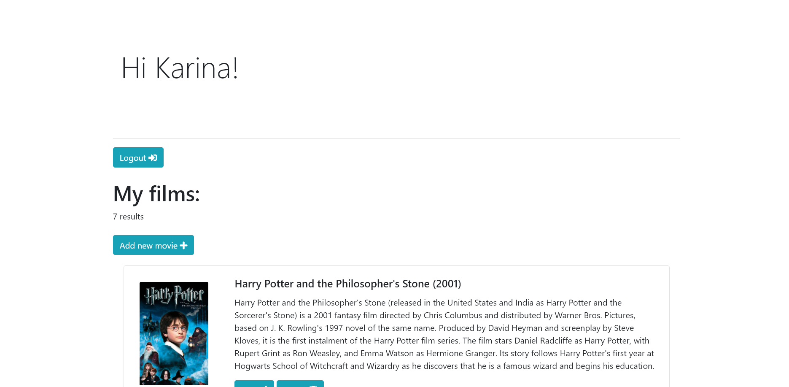
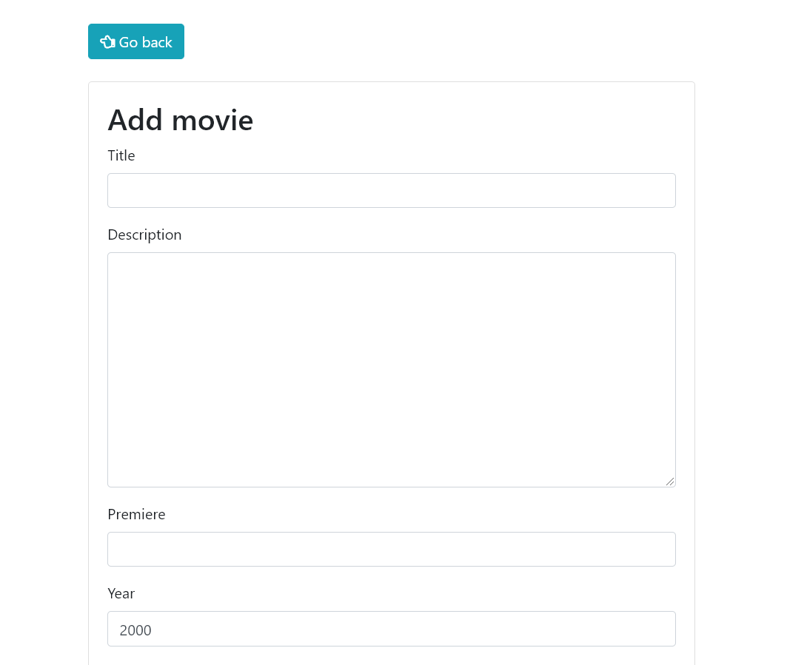
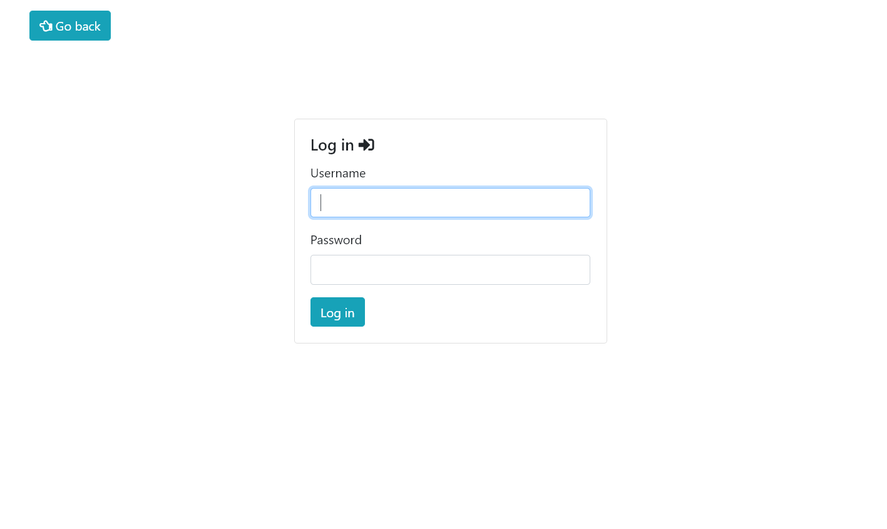

# Django-movies

- Main page


- List of added movies


- Form for adding/editing a movie


- Login form



## Installing

Aftef you download the repo you need to install the requirements:

```
pip install -r requirements.txt
```

To run the app locally, type:

```
python manage.py runserver
```


## Built With

-   Python
-   Django
-   Bootstrap
